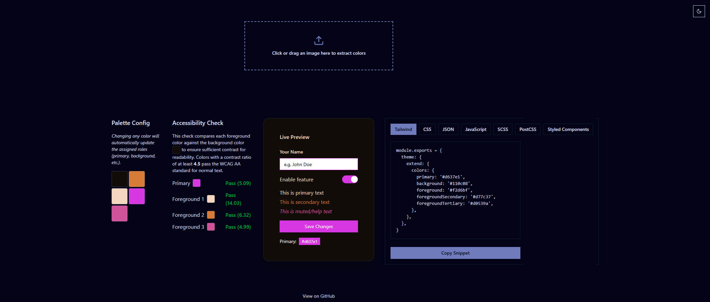

# 🎨 PaletteSnap &nbsp; 

## ✨ What is PaletteSnap?

**PaletteSnap** is an color palette editor that extracts prominent colors from any image and helps you build clean, accessible palettes for web and UI design.

Use it to:  
- 🎯 Pick a solid palette from a photo, game screenshot, or branding image  
- 🎨 Preview your palette on UI components  
- 🧠 Get AI-generated creative color names  
- ♿ Ensure contrast accessibility  
- 🚀 Export your palette in dev-friendly formats (Tailwind, SCSS, JSON, etc.)

## ⚙️ Key Features

✅ **Automatic Color Extraction**  
Upload any image - PaletteSnap extracts and displays its top colors.

🎨 **Semantic Role Assignment**  
Colors are automatically assigned meaningful roles based on luminance and visual weight:  
- `primary`, `background`, and multiple `foreground` values

🛠 **Live Editing & Smart Updates**  
Tweak colors with a color picker. The tool recalculates roles and updates previews dynamically.

🔍 **Accessibility Checks**  
Foreground colors are tested for [WCAG](https://www.w3.org/TR/WCAG21/) contrast compliance with the background. Clear pass/fail indicators help you stay accessible.

👀 **Instant UI Preview**  
See your palette in action on UI components like buttons, cards, and text blocks.

📦 **Flexible Exporting**  
Export your palette as:  
- Tailwind config snippet  
- SCSS/CSS variables  
- JSON structure for any app

🤖 **(Optional) AI Color Naming**  
Let AI name your palette colors with style. No more “blue-500” - how about “Ocean Breeze”?

---

## 🧪 How It Works (Under the Hood)

1. **Upload** an image - We extract its most prominent colors.  
2. **Role Assignment** - Colors are analyzed and assigned based on contrast and luminance:  
   - `background`: lightest/darkest/most neutral color 
   - `primary`: dominant or accent color  
   - `foreground`: multiple text/UI-friendly values  
3. **User Tweak Zone** - Adjust any role and the rest of the system recalibrates.  
4. **Live Accessibility Check** - Realtime WCAG AA/AAA contrast checks for primary and all foregrounds.  
5. **Export & Ship** - Grab code snippets and paste into your project.

---

## 🧰 Tech Stack

- **Frontend:** Next.js 15, Tailwind CSS, ShadCN UI  
- **Backend (AI):** FastAPI (Python) + OpenRouter (GPT-based color name generation)  
- **Hosting:** Vercel (frontend), Render (backend)  

---

## 🚀 Try it Live

👉 [**palette-snap-rho.vercel.app**](https://palette-snap-rho.vercel.app/)
